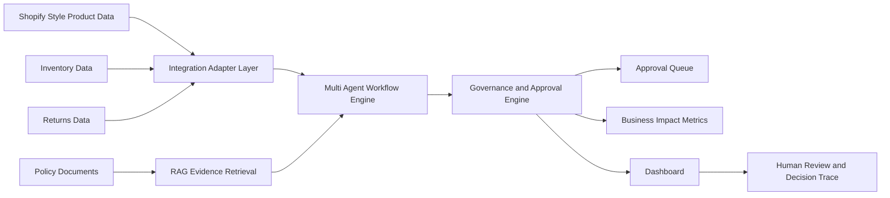
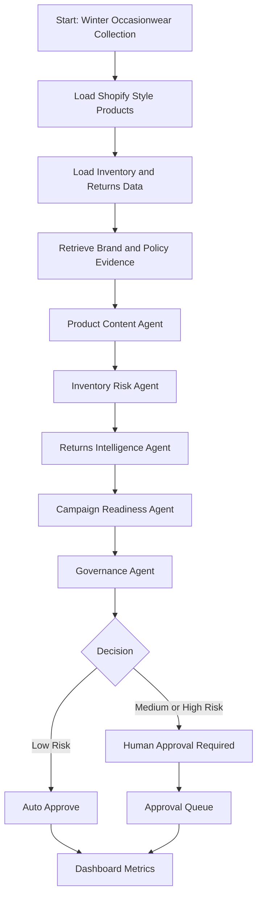
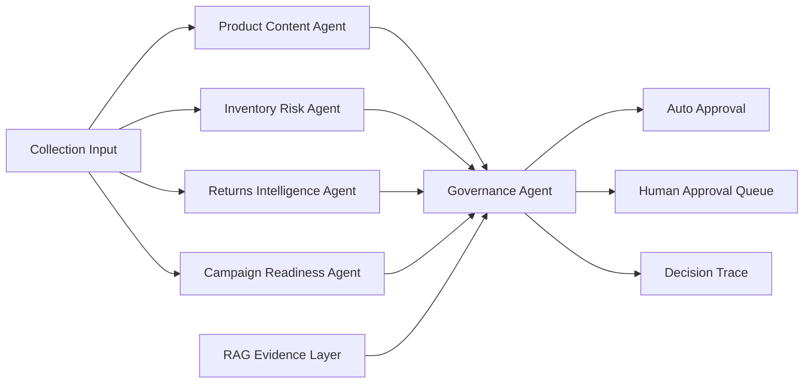
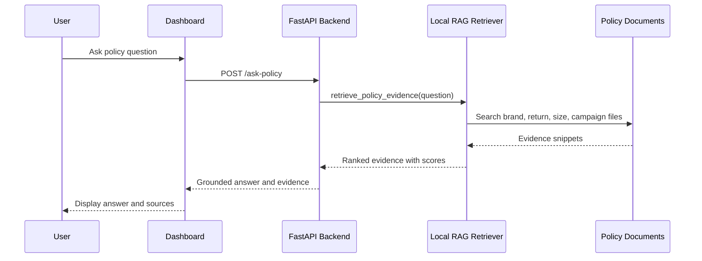
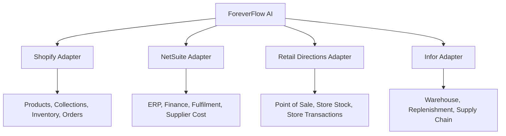
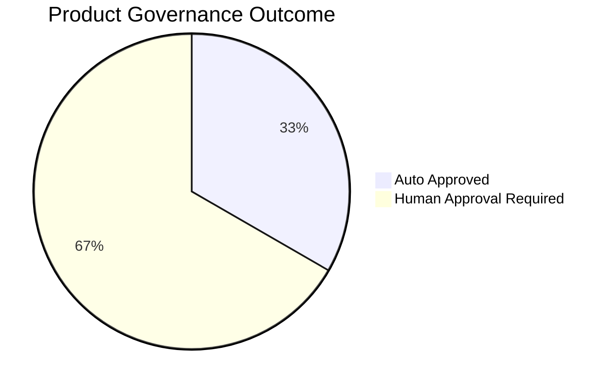
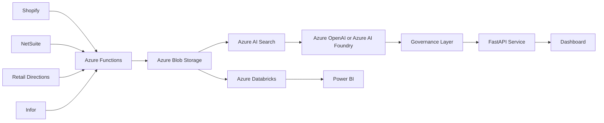
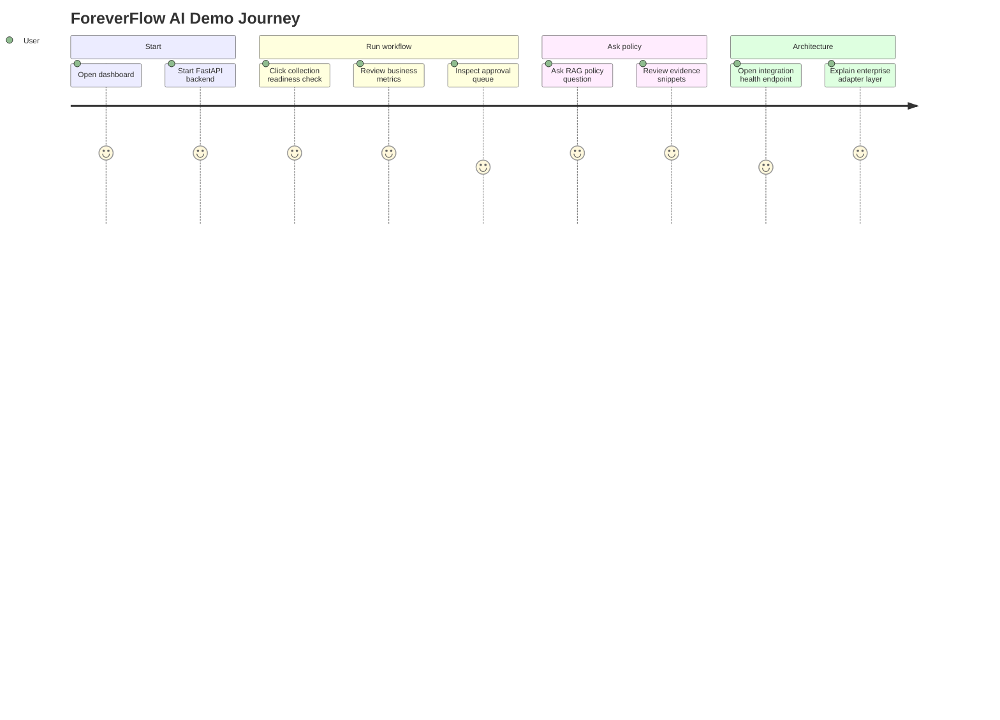
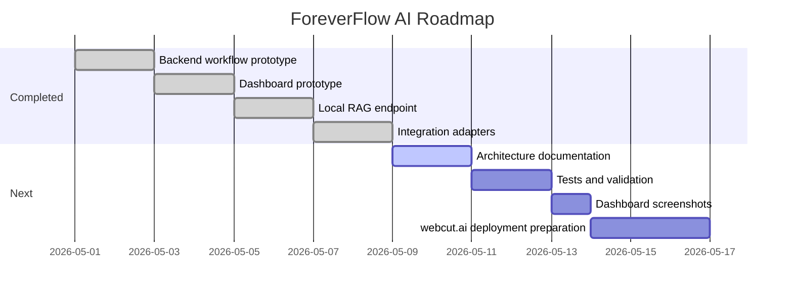

<div align="center">

# ForeverFlow AI

### Retail AI Control Tower for Shopify-Centred Fashion Operations

An end-to-end AI automation showcase for fashion retail digital and eCommerce teams.

[](https://www.python.org/)
[](https://fastapi.tiangolo.com/)
[](#rag-evidence-layer)
[](#ai-agent-system)
[](#enterprise-integration-layer)
[](#azure-aligned-target-architecture)
[](#current-status)

</div>

---

## Executive Summary

ForeverFlow AI is a production-style AI automation platform designed for a women’s fashion retail environment where Shopify acts as the central eCommerce platform.

It demonstrates how AI agents, Retrieval-Augmented Generation (RAG), workflow automation, governance controls, approval queues, and enterprise integration adapters can help digital and eCommerce teams move from idea to production safely.

The current prototype focuses on a `New Collection Launch Readiness` workflow for a mock `Winter Occasionwear` collection.

---

## Why This Matters

Fashion retailers often manage product, campaign, inventory, returns, customer support, and reporting workflows across fragmented systems.

Typical issues include:

| Problem | Business Impact | ForeverFlow AI Response |
|---|---|---|
| Slow product launch checks | Delayed campaigns and manual review effort | Multi-agent collection readiness workflow |
| Missing product content | Poor product detail pages and lower conversion | Product Content Agent |
| Low stock in key sizes | Failed campaigns and lost sales | Inventory Risk Agent |
| High return rates | Margin pressure and customer dissatisfaction | Returns Intelligence Agent |
| AI actions without control | Governance and brand risk | Governance Agent and approval queue |
| Fragmented systems | Duplicated integrations and legacy complexity | Enterprise adapter layer |
| Policy uncertainty | Inconsistent decisions | Local RAG evidence retrieval |

---

## Showcase Snapshot

| Area | Implemented | Description |
|---|---:|---|
| FastAPI backend | Yes | Local API for workflow execution and policy retrieval |
| Dashboard | Yes | Browser-based dashboard for demo and visual review |
| Multi-agent workflow | Yes | Product, inventory, returns, campaign, and governance agents |
| RAG evidence layer | Yes | Retrieves evidence from local policy files |
| Policy assistant | Yes | Ask business questions and retrieve grounded evidence |
| Approval queue | Yes | Flags risky products for human review |
| Business metrics | Yes | Products checked, risks, approvals, hours saved |
| Integration adapters | Yes | Mock Shopify, NetSuite, Retail Directions, and Infor connectors |
| Azure architecture | Planned | Azure OpenAI, Azure AI Search, Azure Functions, Azure Monitor |
| Databricks and Power BI | Planned | Analytics notebooks and reporting layer |

---

## System Architecture



---

## New Collection Launch Readiness Flow



---

## AI Agent System



### Product Content Agent

Checks product readiness for eCommerce publishing.

- missing product descriptions
- missing care instructions
- missing size guide
- missing colour data
- missing category data

### Inventory Risk Agent

Checks whether products are safe to promote based on size-level availability.

- low stock in core sizes
- promotion risk caused by limited availability
- size curve gaps

### Returns Intelligence Agent

Analyses return rate, return reasons, and customer comments.

- high return-rate products
- fit-related return issues
- unclear care instruction risks
- avoidable return causes

### Campaign Readiness Agent

Creates campaign copy and promotion recommendations.

- campaign suitability
- content readiness
- return risk
- inventory risk

### Governance Agent

Controls whether an AI recommendation can proceed.

- auto approve
- human approval required
- review required before promotion

---

## RAG Evidence Layer

ForeverFlow AI includes a local RAG-style retriever that grounds workflow decisions in trusted business documents.

Current knowledge sources:

| Source | Purpose |
|---|---|
| `brand_voice_guide.md` | Product copy and tone guidance |
| `return_policy.md` | Return, refund, and exception rules |
| `size_guide.md` | Fit notes and size guidance rules |
| `campaign_brief.md` | Campaign readiness rules |

### Policy Question Flow



Example question:

```text
Should this product be promoted if core sizes are low and return risk is high?
```

---

## Enterprise Integration Layer

ForeverFlow AI demonstrates integration simplification through clean adapters for retail systems.



| Adapter | Current Status | Purpose |
|---|---|---|
| Shopify | Mock connected | Central eCommerce product and collection workflow |
| NetSuite | Planned mock | ERP, finance, fulfilment, purchase orders |
| Retail Directions | Planned mock | Store sales, store stock, point-of-sale data |
| Infor | Planned mock | Warehouse, replenishment, supply chain planning |

Endpoint:

```text
GET /integration-health
```

---

## Dashboard Preview

The current dashboard is available locally at:

```text
frontend/dashboard/index.html
```

Dashboard sections:

- Business Impact Cards
- Collection Readiness Button
- Workflow Timeline
- Approval Queue
- Product Agent Results
- RAG Evidence Viewer
- Policy RAG Assistant
- Raw API Response Viewer

Planned screenshot placeholders:

| Screen | Purpose | Status |
|---|---|---|
| Dashboard Overview | Show business metrics and workflow state | To add |
| Approval Queue | Show risky products requiring review | To add |
| RAG Evidence Viewer | Show grounded policy snippets | To add |
| Integration Health | Show enterprise adapter status | To add |

---

## Business Impact Metrics

Current sample result for the mock `Winter Occasionwear` collection:

```text
Products Checked: 6
Issues Found: 6
High-Risk Items: 3
Approval Required: 4
Auto Approved: 2
Estimated Hours Saved: 4.2
```



| Metric | Meaning |
|---|---|
| Products Checked | Number of products reviewed in the collection |
| Issues Found | Product content gaps detected |
| High-Risk Items | Products with high inventory or return risk |
| Approval Required | Products requiring human review |
| Auto Approved | Products safe to proceed |
| Estimated Hours Saved | Approximate manual review effort reduced |

---

## API Endpoints

| Method | Endpoint | Purpose |
|---|---|---|
| GET | `/` | Backend health check |
| POST | `/run-collection-readiness` | Runs the multi-agent collection readiness workflow |
| POST | `/ask-policy` | Retrieves policy evidence for a business question |
| GET | `/integration-health` | Shows mock enterprise integration adapter status |

### Example: Run Collection Readiness

```json
{
  "collection_name": "Winter Occasionwear"
}
```

### Example: Ask Policy RAG

```json
{
  "question": "Should this product be promoted if core sizes are low and return risk is high?",
  "top_k": 4
}
```

---

## Azure-Aligned Target Architecture



Planned Azure components:

| Component | Role |
|---|---|
| Azure OpenAI / Azure AI Foundry | Large Language Model reasoning and agent orchestration |
| Azure AI Search | Vector and keyword retrieval for RAG |
| Azure Blob Storage | Policy, product, and operational document storage |
| Azure Functions | Workflow triggers and system integration jobs |
| Azure Monitor | Observability, logs, metrics, traces |
| Azure Databricks | Analytics, feature pipelines, returns and inventory insights |
| Power BI | Business reporting and operational dashboards |

---

## Project Structure

```text
foreverflow-ai/
  architecture/
  backend/
    app/
      connectors/
        enterprise_connectors.py
      rag/
        simple_retriever.py
      main.py
  data/
    policies/
      brand_voice_guide.md
      campaign_brief.md
      return_policy.md
      size_guide.md
    products.json
    inventory.json
    returns.json
  frontend/
    dashboard/
      index.html
  tests/
  add_integration_adapters.py
  add_local_rag.py
  add_policy_dashboard.py
  create_dashboard.py
  setup_project.py
  update_mock_data.py
  write_readme.py
  requirements.txt
  README.md
```

---

## Run Locally

### 1. Install dependencies

```cmd
python -m pip install -r requirements.txt
```

### 2. Start backend

```cmd
python -m uvicorn backend.app.main:app --reload
```

### 3. Open Swagger UI

```text
http://127.0.0.1:8000/docs
```

### 4. Open dashboard

```text
D:\AI\foreverflow-ai\frontend\dashboard\index.html
```

---

## Demo Script



---

## Security Notes

This public repository uses mock data only.

It does not include:

- API keys
- Shopify access tokens
- Azure credentials
- AWS credentials
- database passwords
- private customer data
- production secrets

A `.gitignore` file is included to reduce the risk of committing local secrets, virtual environments, logs, and temporary files.

---

## Roadmap



Next planned improvements:

- add architecture documents
- add workflow tests
- add dashboard screenshots
- add approval action buttons
- add review insights module
- add Databricks-style analytics notebooks
- add Power BI-style report export
- prepare deployment to webcut.ai

---

## Positioning

ForeverFlow AI demonstrates the ability to design and deliver production-oriented AI automation for retail digital and eCommerce operations.

It combines AI agents, RAG, workflow automation, governance, enterprise integration adapters, and measurable business metrics in a Shopify-centred fashion retail scenario.

<div align="center">

**Built as a senior AI automation engineering showcase for fashion retail transformation.**

</div>
