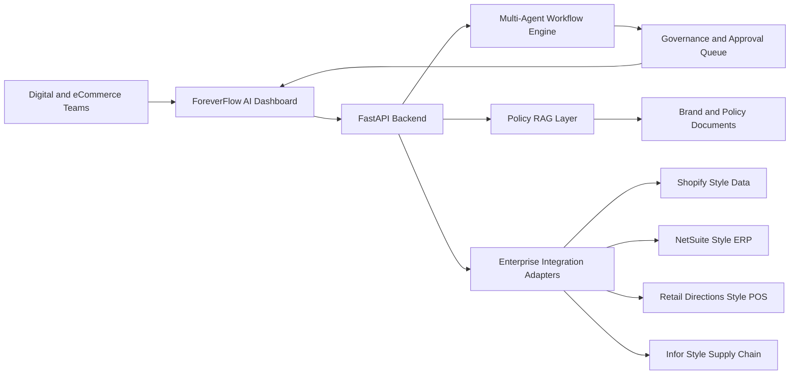
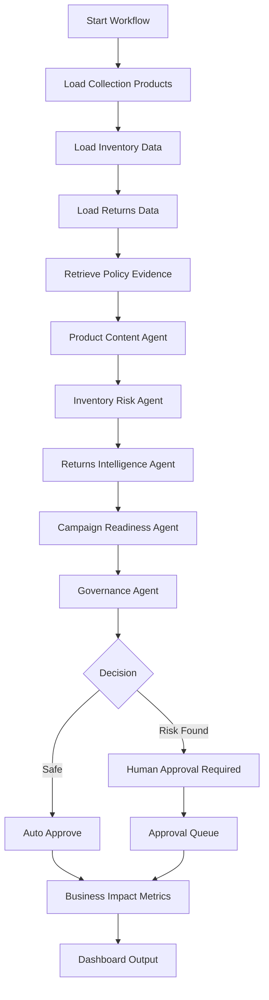
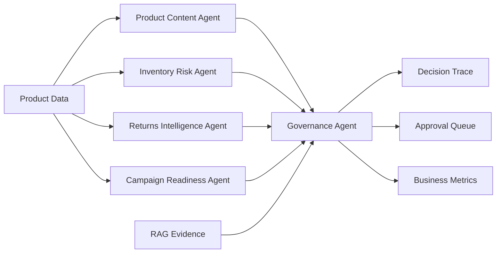
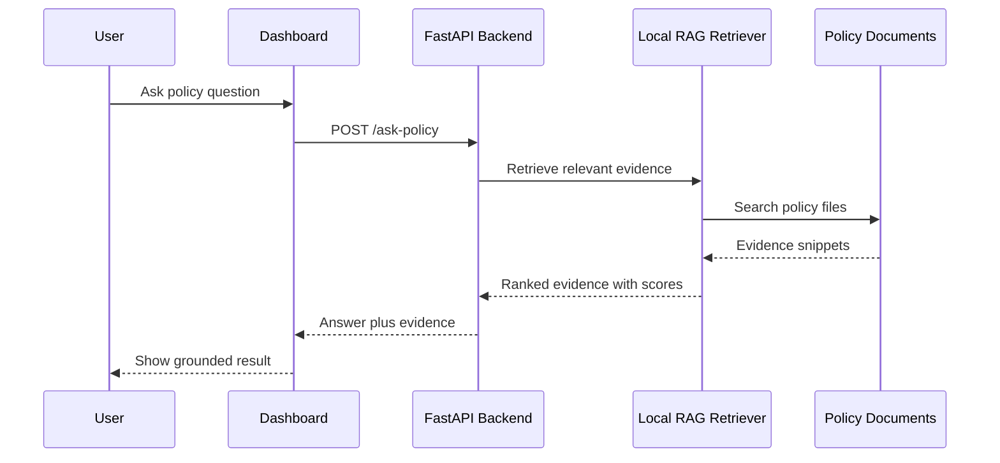
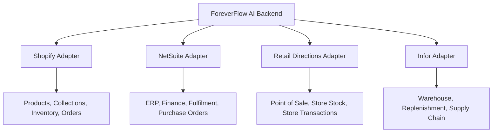
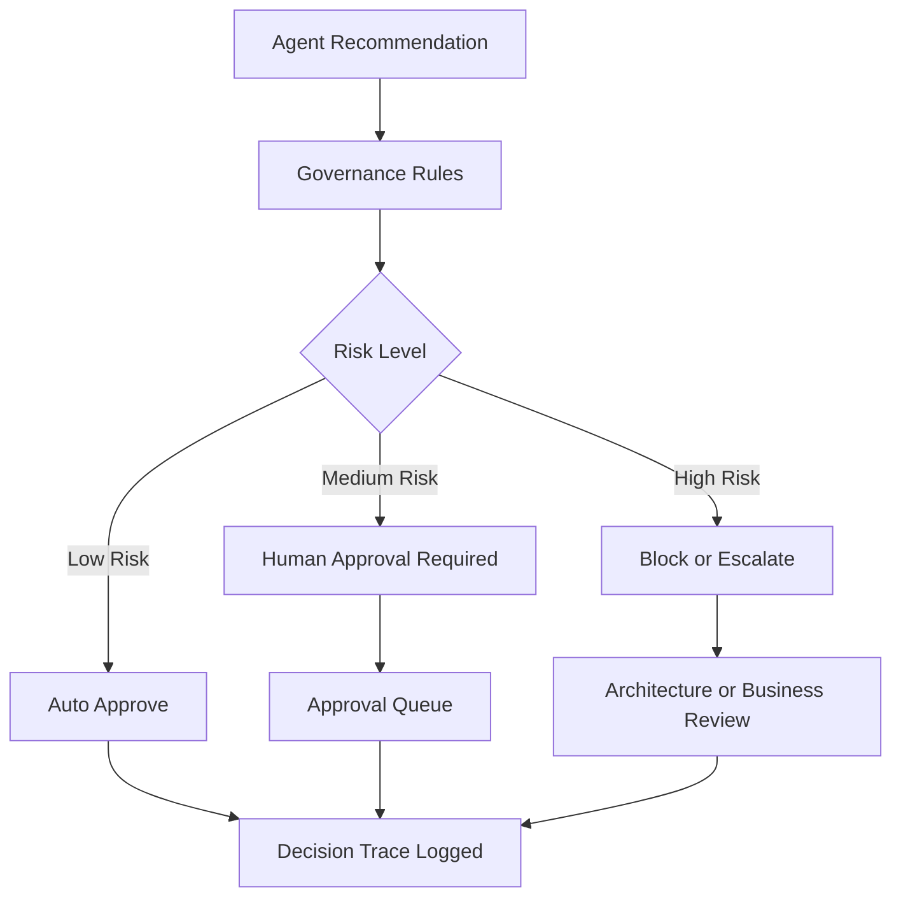
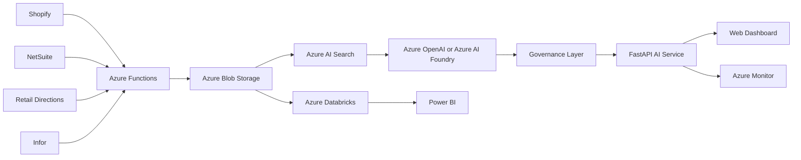
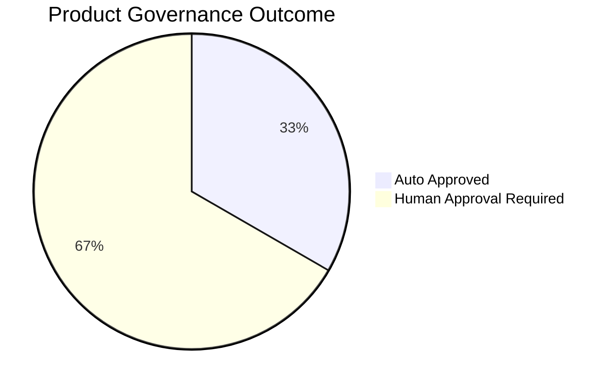

# ForeverFlow AI Architecture Overview

## Retail AI Control Tower for Shopify-Centred Fashion Operations

This document explains the high-level architecture of ForeverFlow AI, including the AI workflow, RAG evidence layer, governance model, integration adapter layer, and Azure-aligned target architecture.

---

## 1. System Context

ForeverFlow AI is designed for a fashion retail environment where Shopify is the central eCommerce platform and surrounding systems provide inventory, returns, fulfilment, finance, point-of-sale, supply chain, and reporting data.



---

## 2. New Collection Launch Readiness Workflow

The current implemented workflow checks whether a fashion collection is ready for launch or campaign promotion.



---

## 3. AI Agent Responsibilities

| Agent | Responsibility | Output |
|---|---|---|
| Product Content Agent | Checks product descriptions, care instructions, size guide, colour, and category completeness | Content score and content issues |
| Inventory Risk Agent | Checks size-level stock availability before promotion | Inventory risk level and low-stock sizes |
| Returns Intelligence Agent | Reviews return rate, return reason, and customer comments | Return risk level and return explanation |
| Campaign Readiness Agent | Drafts campaign copy and recommends promotion suitability | Campaign copy and recommendation |
| Governance Agent | Decides whether the product can proceed or needs review | Auto approval or human approval decision |



---

## 4. RAG Evidence Flow

The local RAG layer retrieves relevant policy evidence from trusted internal documents before workflow decisions are displayed.

Current documents:

- brand voice guide
- return policy
- size guide
- campaign brief



---

## 5. Enterprise Integration Adapter Layer

The adapter layer demonstrates how fragmented retail systems can be wrapped behind clean, reusable API-style connectors.



The key design principle is to avoid hardcoding AI workflows directly into every enterprise system. Instead, each system is exposed through a clean connector with standard output schemas, validation, logging, and governance.

---

## 6. Governance and Human Approval Flow

ForeverFlow AI does not allow every AI recommendation to proceed automatically. Risky actions are routed to human review.



Examples of review triggers:

- missing product description
- missing care instructions
- missing size guide
- low stock in core sizes
- high return risk
- customer-facing promise requiring policy validation

---

## 7. Azure-Aligned Target Architecture

The current prototype runs locally, but the architecture is designed to map to Azure services.



| Azure Component | Intended Role |
|---|---|
| Azure OpenAI / Azure AI Foundry | Large Language Model reasoning and agent orchestration |
| Azure AI Search | Vector and keyword retrieval for RAG |
| Azure Blob Storage | Policy, product, and operational document storage |
| Azure Functions | Workflow triggers and integration jobs |
| Azure Databricks | Analytics, feature pipelines, returns and inventory analysis |
| Power BI | Business reporting and operational dashboards |
| Azure Monitor | Logs, traces, metrics, and operational observability |

---

## 8. Current Implemented Endpoints

| Method | Endpoint | Purpose |
|---|---|---|
| GET | `/` | Backend health check |
| POST | `/run-collection-readiness` | Runs the collection readiness workflow |
| POST | `/ask-policy` | Retrieves policy evidence for a business question |
| GET | `/integration-health` | Shows mock integration adapter status |

---

## 9. Current Business Metrics

For the mock `Winter Occasionwear` collection, the workflow currently produces:

```text
Products Checked: 6
Issues Found: 6
High-Risk Items: 3
Approval Required: 4
Auto Approved: 2
Estimated Hours Saved: 4.2
```



---

## 10. Design Intent

ForeverFlow AI is designed to demonstrate how a Senior AI Automation Engineer can translate business problems into production-oriented AI capabilities.

The project focuses on:

- AI agents beyond proof of concept
- RAG over trusted business documents
- Shopify-centred digital and eCommerce workflows
- enterprise API integration patterns
- governance and human approval
- measurable business outcomes
- Azure-aligned scalability path
